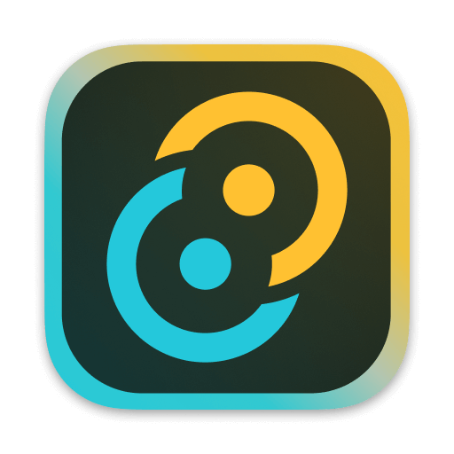

# Zenith Editor

<div align="center">
  
  <h2>Local-first subtitle editor for short-form video</h2>
  <p>Edit fast, generate captions on-device, and export clean social-ready videos.</p>
  <p>
    <a href="#download">Download</a> ·
    <a href="#features">Features</a> ·
    <a href="#how-to-install">How to Install</a> ·
    <a href="#quick-how-to-use">How To Use</a> ·
    <a href="#whisper-models">Whisper Models</a>
  </p>
</div>

<p align="center">
  <a href="docs/screenshots/editor-overview.png">
    
  </a>
</p>

Zenith Editor is a desktop app that keeps your workflow local and focused: import media, edit on a timeline, generate subtitles with local Whisper models, style captions, and export to MP4.

This repository is release-only (binaries, docs, and release notes). Zenith Editor source code is currently private.

## Features

- Local-first subtitle workflow for short-form content.
- Timeline-based editing with project asset management.
- On-device subtitle generation using Whisper models.
- Subtitle styling controls (font, size, text color, background, alignment).
- One-click MP4 export for publishing.

## Download

- Latest release page (macOS + Windows): https://github.com/hlk-trkn/zenith-editor-releases/releases/latest
- Files to download from Releases:
  - macOS: `Zenith Desktop_*_aarch64.dmg` (older releases may use `Zenith Editor_*_aarch64.dmg`)
  - Windows: `Zenith Desktop_*_x64_en-US.msi`

### Repository build archive layout

- `Builds/PC/` -> local archive of Windows MSI builds and checksums
- `Builds/Mac/` -> local archive of macOS DMG builds and checksums
- Official public downloads should always come from the GitHub Releases page above

## How to Install

### 1) Install Zenith Editor

- macOS: open the DMG and drag `Zenith Desktop.app` into Applications.
- Windows: run the MSI and launch from Start Menu.

If Windows SmartScreen appears on first run, click `More info` -> `Run anyway`.

### 2) Install FFmpeg (Required)

Zenith needs both `ffmpeg` and `ffprobe` on macOS and Windows.

macOS (Homebrew, recommended):

```bash
if ! command -v brew >/dev/null 2>&1; then
  /bin/bash -c "$(curl -fsSL https://raw.githubusercontent.com/Homebrew/install/HEAD/install.sh)"
fi
brew install ffmpeg
```

If Terminal shows `brew: command not found` after installing Homebrew:

```bash
echo 'eval "$(/opt/homebrew/bin/brew shellenv)"' >> ~/.zprofile
eval "$(/opt/homebrew/bin/brew shellenv)"
brew install ffmpeg
```

Windows (choose one):

```powershell
winget install --id Gyan.FFmpeg -e
```

```powershell
choco install ffmpeg -y
```

```powershell
scoop install ffmpeg
```

### 3) Verify FFmpeg

Run in Terminal (macOS) or PowerShell (Windows):

```bash
ffmpeg -version
ffprobe -version
```

Then fully close and reopen Zenith Editor.

## Screenshots

Click any screenshot to open full resolution.

<table>
  <tr>
    <td align="center">
      <a href="docs/screenshots/editor-overview.png">
        
      </a>
      <br />
      <sub>Editor Overview</sub>
    </td>
    <td align="center">
      <a href="docs/screenshots/timeline.png">
        
      </a>
      <br />
      <sub>Timeline</sub>
    </td>
  </tr>
  <tr>
    <td align="center">
      <a href="docs/screenshots/subtitles-panel.png">
        
      </a>
      <br />
      <sub>Subtitles Panel</sub>
    </td>
    <td align="center">
      <a href="docs/screenshots/export-result.png">
        
      </a>
      <br />
      <sub>Export Result</sub>
    </td>
  </tr>
</table>

## Quick How To Use

1. Import media in **Project Assets** (`+` button or drag-drop).
2. Place clips on timeline tracks.
3. Select a video clip and click **Generate Local Subtitles**.
4. Style subtitles in **Subtitles** tab (font, size, text color, background, vertical alignment).
5. Click **EXPORT** to render MP4.

## Whisper Models

Supported models:

- `whisper-tiny` (~75 MB)
- `whisper-small` (~466 MB)
- `whisper-medium` (~1.53 GB, default)
- `whisper-large-v3-turbo` (~1.60 GB)

Speed vs accuracy guide:

- **Tiny**: fastest, lowest accuracy. Best for quick drafts.
- **Small**: fast with better quality than tiny. Good for iteration.
- **Medium**: best overall balance for most users.
- **Large V3 Turbo**: strongest accuracy on difficult/noisy audio, heaviest runtime.

### Model Download

- Open **Inspector -> Subtitles**.
- Select the model.
- Click **Download Model**.
- Missing models can auto-download when generation starts.

## Open-Source Dependencies

Zenith Editor relies on these open-source components:

- FFmpeg / ffprobe (media decode/encode/render pipeline)  
  License: LGPL-2.1-or-later (with optional GPL components depending on build)
- whisper.cpp (local ASR runtime)  
  License: MIT
- OpenAI Whisper models/code (speech-to-text model family)  
  License: MIT
- whisper-rs (Rust bindings used by Zenith backend)  
  License: Unlicense

For full attribution and license references, see `THIRD_PARTY_NOTICES.md`.

Note: Zenith expects FFmpeg on the user system and does not bundle FFmpeg binaries in the app package. Custom/community Whisper models may use different licenses; check each model page before use.
