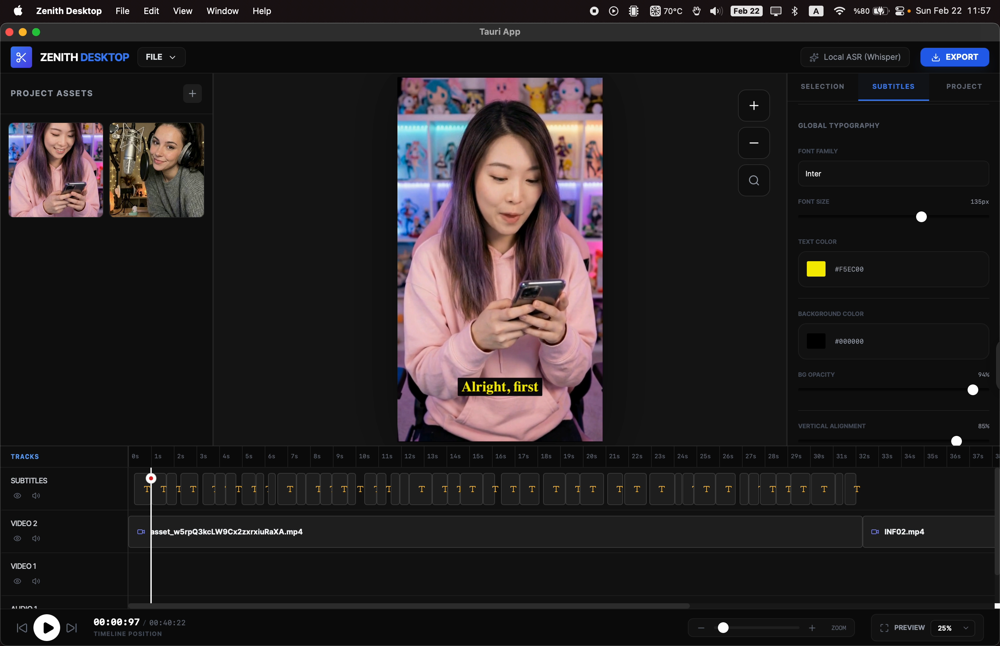
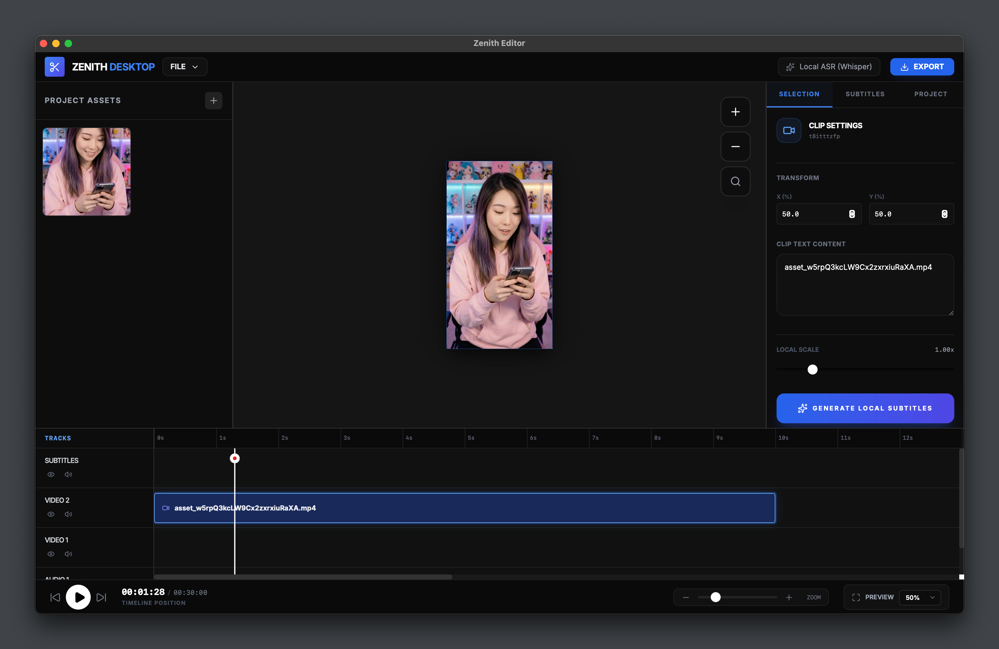
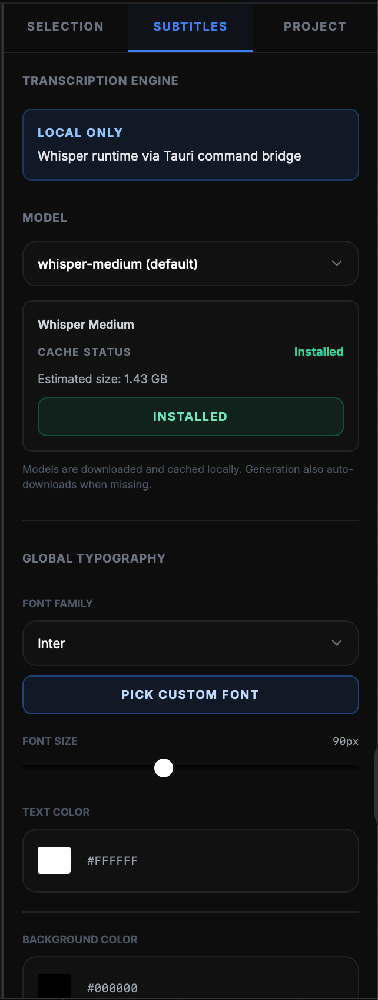
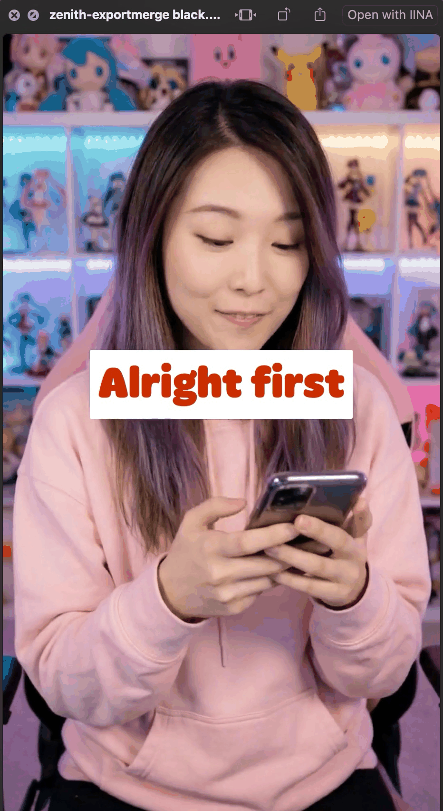

# Zenith Editor

Zenith Editor is a local-first desktop subtitle editor for short-form video.

This repository is release-only (binaries, docs, and release notes). Zenith Editor source code is currently private.

## Download

- Open the latest release on GitHub Releases.
- Download the macOS DMG.
- Drag `Zenith Desktop.app` into Applications.

## Screenshots

Add your screenshots to `docs/screenshots/` and keep these links:

<a href="docs/screenshots/editor-overview.png">
  
</a>

<a href="docs/screenshots/timeline.png">
  
</a>

<a href="docs/screenshots/subtitles-panel.png">
  
</a>

<a href="docs/screenshots/export-result.png">
  
</a>

## Quick How To Use

1. Import media in **Project Assets** (`+` button or drag-drop).
2. Place clips on timeline tracks.
3. Select a video clip and click **Generate Local Subtitles**.
4. Style subtitles in **Subtitles** tab (font, size, text color, background, vertical alignment).
5. Click **EXPORT** to render MP4.

## Whisper Models

Supported models:

- `whisper-tiny` (~75 MB)
- `whisper-small` (~466 MB)
- `whisper-medium` (~1.53 GB, default)
- `whisper-large-v3-turbo` (~1.60 GB)

Speed vs accuracy guide:

- **Tiny**: fastest, lowest accuracy. Best for quick drafts.
- **Small**: fast with better quality than tiny. Good for iteration.
- **Medium**: best overall balance for most users.
- **Large V3 Turbo**: strongest accuracy on difficult/noisy audio, heaviest runtime.

### Model download

- Open **Inspector -> Subtitles**.
- Select the model.
- Click **Download Model**.
- Missing models can auto-download when generation starts.

## Required Dependency (macOS)

Zenith needs both `ffmpeg` and `ffprobe`.

Install:

```bash
brew install ffmpeg
```

If Zenith was open during install, restart the app.
